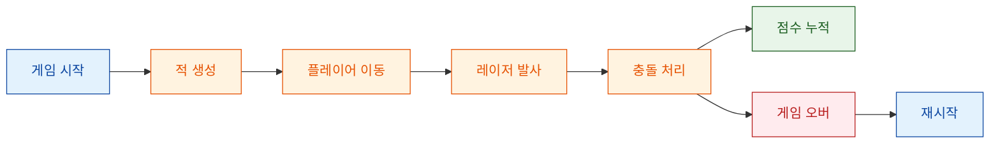

# 🚀 Mini Galaxy Defender

**Mini Galaxy Defender**는 YU Studio에서 제작 중인 미니 아케이드 슈팅 게임입니다.  
작은 화면 안에서 빠른 회피, 정확한 발사, 끊임없이 몰려오는 적을 상대하는 짧고 경쾌한 플레이를 목표로 합니다.

현재 버전은 핵심 전투 루프에 집중한 초기 프로토타입입니다.  
플레이어 이동, 레이저 발사, 적 스폰, 충돌 판정, 점수 누적, 게임 오버와 재시작까지 기본적인 슈팅 게임 흐름을 제공합니다.

## 🎮 Game Pitch

은하 방어선이 무너지고 있습니다.  
플레이어는 마지막 방어선에 배치된 소형 전투기를 조종해, 위에서 쏟아지는 적기를 격추해야 합니다.

복잡한 조작은 없습니다.  
마우스로 이동하고, 클릭으로 발사하고, 최대한 오래 버티면 됩니다.

Mini Galaxy Defender는 다음 감각을 목표로 합니다.

- 빠르게 시작할 수 있는 아케이드 플레이
- 직관적인 마우스 조작
- 짧은 라운드 중심의 반복 플레이
- 점수 갱신을 노리는 단순한 목표
- 작지만 확장 가능한 게임 구조

## 🖼️ Visual Targets

현재 프로토타입은 우주 배경, 플레이어 기체, 적 기체, 레이저 에셋을 기반으로 동작합니다.


## 🔁 Core Game Loop

게임은 간단한 아케이드 루프를 중심으로 진행됩니다.



## ✨ Features

- 마우스 기반 플레이어 좌우 이동
- 좌클릭 레이저 발사
- 적 기체 랜덤 생성
- 레이저와 적 충돌 판정
- 적 격추 시 점수 증가
- 적과 충돌 시 게임 오버
- 게임 오버 후 R 키로 재시작

## 🚀 Quick Start

게임을 실행합니다.

```bash
python -m mini_galaxy_defender.main
```

## 🕹️ Controls

| Input | Action |
| --- | --- |
| 마우스 이동 | 플레이어 좌우 이동 |
| 마우스 좌클릭 | 레이저 발사 |
| `R` | 게임 오버 후 재시작 |
| 창 닫기 | 게임 종료 |

## 🧪 Test

테스트는 다음 명령어로 실행합니다.

```bash
pytest -q
```

## 📁 Project Structure

```text
mini_galaxy_defender/
├─ assets.py     # 이미지 에셋 로딩
├─ config.py     # 화면 크기, 속도, 색상 등 게임 설정
├─ game.py       # pygame 메인 루프
├─ logic.py      # 적 스폰, 이동, 충돌 판정
└─ main.py       # 실행 진입점
```

## 🗺️ Development Roadmap

Mini Galaxy Defender는 현재 핵심 전투 루프를 검증하는 단계입니다.  
다음 업데이트에서는 게임의 타격감, 반복 플레이, 난이도 곡선을 강화하는 기능들이 필요합니다.

우선적으로 개선하고 싶은 방향은 다음과 같습니다.

- 적 종류 추가
- 적 이동 패턴 다양화
- 적 탄환 또는 공격 패턴 추가
- 플레이어 체력과 목숨 시스템
- 파워업 아이템
- 배경 스크롤과 패럴랙스 효과
- 피격 이펙트와 폭발 애니메이션
- 콤보 및 보너스 점수 시스템
- 최고 점수 저장
- 난이도 프리셋
- 게임 시작 화면과 결과 화면 개선
- 테스트 케이스 보강

## 🤝 Join the Defense

Mini Galaxy Defender는 더 완성도 높은 미니 슈팅 게임으로 발전하기 위한 기여를 기다리고 있습니다.

작은 개선도 게임의 느낌을 크게 바꿀 수 있습니다.  
레이저 속도 조정, 적 스폰 간격 개선, 사운드 타이밍 수정, UI 문구 정리처럼 작은 변경부터 새로운 적, 파워업, 랭킹 시스템 같은 기능 확장까지 모두 환영합니다.

특히 아래 작업에 대한 기여가 필요합니다.

- 👾 새로운 적 기체와 이동 패턴 추가
- 🔫 레이저, 탄환, 공격 패턴 개선
- 💥 폭발 효과와 피격 이펙트 추가
- 🌌 배경 스크롤 또는 패럴랙스 구현
- ❤️ 체력, 목숨, 무적 시간 시스템 추가
- ⚡ 파워업 아이템 구현
- 🏆 최고 점수 저장 기능 추가
- 🔊 사운드 효과와 재생 타이밍 개선
- 🧪 게임 로직 테스트 보강
- 📚 README와 플레이 가이드 개선

새로운 아이디어가 있다면 이슈로 제안하거나 PR로 직접 구현해 주세요.  
작은 업데이트가 쌓이면 Mini Galaxy Defender는 훨씬 더 빠르고, 선명하고, 재미있는 아케이드 슈터가 됩니다.

## 📜 Credits

이 프로젝트는 외부 게임 에셋을 사용합니다.  
에셋의 출처와 라이선스 정보는 `assets`에서 확인할 수 있습니다.

소스 코드는 MIT License로 배포됩니다.  
외부 에셋은 각 에셋의 원 라이선스를 따릅니다.
